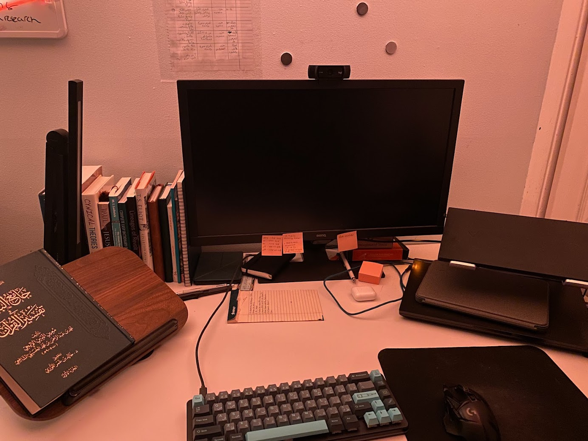

+++
draft = false
title = 'About me'
+++

I'm a master's student in Computer Science specializing in systems programming. I like to spend time thinking about things. 

Current fixations: embedded C on STM32, obscure C++ features, classical Arabic morphosyntax & grammar, existentialism.

Currently reading:

[Problems of Dostoevsky's Poetics](https://books.google.com/books/about/Problems_of_Dostoevsky_s_Poetics.html?id=mTAxnwEACAAJ) by Mikhail Bakthin

[قطر الندى وبل الصدى]() by Ibn Hisham

  <ul>
    <li><a href="https://github.com/reyhanquayum"><i class="fa-brands fa-github"></i> reyhanquayum</a></li>
    <li><a href="mailto:reyhan.quayum@gmail.com"><i class="fa-regular fa-envelope"></i> reyhan.quayum@gmail.com</a></li>
    <li><a href="https://www.linkedin.com/in/reyhan-quayum/"><i class="fa-brands fa-linkedin"></i> Reyhan Quayum</a></li>
  </ul>
  

